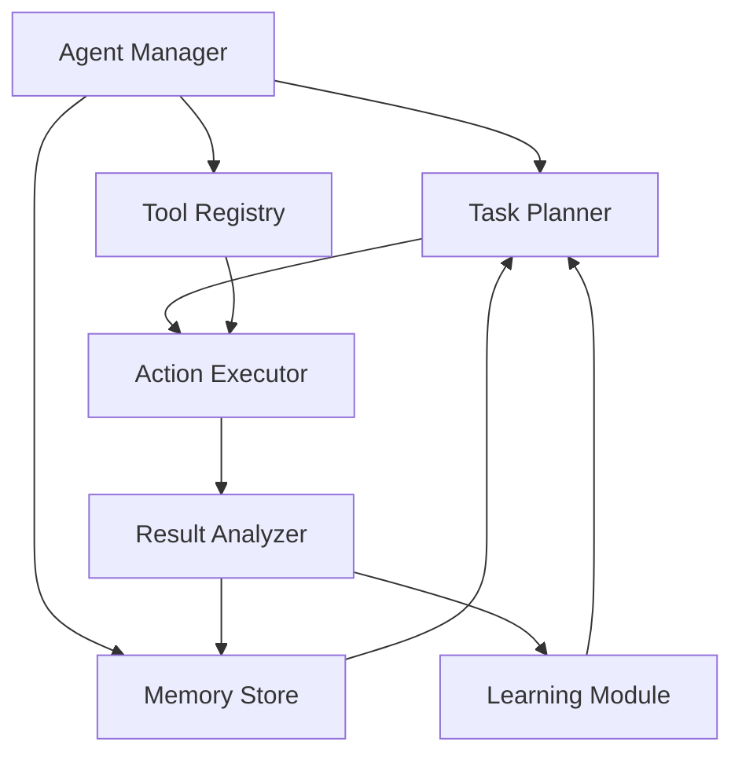

# Agentic System

## Overview

The Agentic System is a sophisticated component of our AI Marketplace platform that enables the creation and management of autonomous AI agents. These agents can perform complex tasks, make decisions, and interact with various services and APIs.

## Key Features

- 🤖 **Autonomous Agents**
  - Goal-oriented behavior
  - Decision-making capabilities
  - Self-improvement mechanisms
  - Task planning and execution

- 🔄 **Tool Integration**
  - API integration framework
  - Custom tool development
  - Tool discovery and management
  - Usage monitoring and optimization

- 🧠 **Learning Capabilities**
  - Reinforcement learning
  - Experience replay
  - Performance optimization
  - Adaptive behavior

## Architecture



## Getting Started

### Prerequisites

- Python 3.8+ for SDK usage
- Understanding of agent-based systems
- API key for authentication

### Quick Start

1. **Install the SDK:**
   ```bash
   pip install ai-marketplace-agentic
   ```

2. **Create an agent:**
   ```python
   from ai_marketplace.agentic import Agent

   agent = Agent(
       name="research_assistant",
       capabilities=["web_search", "document_analysis"],
       goals=["gather_information", "summarize_findings"]
   )
   ```

3. **Define agent behavior:**
   ```python
   @agent.action
   def search_web(query):
       # Implement web search logic
       return results

   @agent.action
   def analyze_document(text):
       # Implement document analysis
       return analysis
   ```

4. **Run the agent:**
   ```python
   result = agent.run(
       task="Research AI trends and create a summary",
       constraints={"time_limit": "1h"}
   )
   ```

## Best Practices

1. **Agent Design**
   - Define clear goals and constraints
   - Implement proper error handling
   - Use appropriate tools for tasks
   - Monitor agent behavior

2. **Tool Integration**
   - Validate tool outputs
   - Implement rate limiting
   - Handle API failures gracefully
   - Cache frequently used results

3. **Performance Optimization**
   - Optimize tool selection
   - Implement parallel processing
   - Use efficient data structures
   - Monitor resource usage

## Advanced Features

### Custom Tool Development

```python
from ai_marketplace.agentic import Tool

class CustomTool(Tool):
    def __init__(self):
        super().__init__(
            name="custom_tool",
            description="Performs custom operations"
        )
    
    def execute(self, params):
        # Implement tool logic
        return result
```

### Memory Management

```python
# Configure agent memory
agent.configure_memory(
    short_term_capacity=1000,
    long_term_storage="vector_db",
    retrieval_strategy="semantic"
)
```

### Learning Configuration

```python
# Set up learning parameters
agent.configure_learning(
    algorithm="reinforcement",
    reward_function=custom_reward,
    exploration_rate=0.1
)
```

## Monitoring and Analytics

- Agent performance metrics
- Tool usage statistics
- Learning progress tracking
- Resource utilization

## Support and Resources

- [API Documentation](api-reference/endpoints.md)
- [SDK Documentation](api-reference/sdk.md)
- [Community Forum](https://community.ai-marketplace.com)
- [Support Email](mailto:support@ai-marketplace.com)

## Related Components

- [LLM Integration](components/llm/overview.md) - For natural language understanding
- [Vector Database](components/vector-db/overview.md) - For memory storage
- [Monitoring & Dashboard](components/monitoring/overview.md) - For performance tracking 