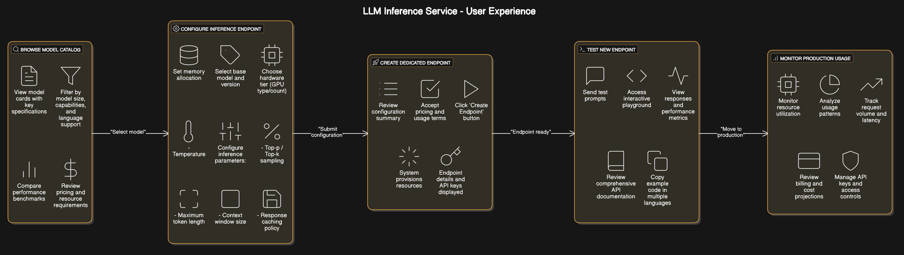

# LLM Integration

## Introduction

Syntera Marketplace's LLM Integration component is an enterprise-grade platform for deploying, managing, and accessing open-source large language models (LLMs) and AI agents. This documentation provides comprehensive guidance for efficiently utilizing our platform to integrate powerful AI capabilities into your applications through our API endpoints.

## Table of Contents

1. [Platform Overview](#platform-overview)
2. [Available Models](#available-models)
3. [Getting Started](#getting-started)
4. [Model Selection Guide](#model-selection-guide)
5. [Model Configuration](#model-configuration)
6. [API Reference](#api-reference)
7. [Security & Compliance](#security-compliance)
8. [Rate Limits & Performance](#rate-limits-performance)
9. [Troubleshooting](#troubleshooting)
10. [Use Case Examples](#use-case-examples)
11. [Best Practices](#best-practices)
12. [FAQs](#faqs)

## Platform Overview

Syntera Marketplace enables organizations to leverage state-of-the-art AI models through our API endpoints. Our platform distinguishes itself through:

### Key Features

- 🤖 **Multiple Model Support**
  - Access to various open-source and proprietary models
  - Easy model switching through configuration
  - Automatic resource scaling for complex requests
  - Cost-effective resource allocation

- 🔄 **Resource Management**
  - Dynamic resource allocation based on request complexity
  - Automatic scaling to dedicated machines for heavy workloads
  - Cost optimization through resource sharing
  - Performance monitoring and optimization

- 🛠️ **API Integration**
  - Simple REST API endpoints
  - Consistent response format
  - Webhook support for async operations
  - Streaming response handling

## Platform Architecture

{.llm-arch-img}

## Available Models

### Language Models (LLMs)

| Model Category | Description | Use Cases |
|----------------|-------------|-----------|
| Instruction-tuned LLMs | Models optimized for following specific instructions | Chatbots, virtual assistants, content generation |
| Base LLMs | Foundation models with broader capabilities | Research, fine-tuning projects, creative applications |
| Specialized LLMs | Domain-specific models (legal, financial, medical, etc.) | Industry-specific applications requiring domain expertise |

### Multimodal Models

Models capable of processing both text and other data types:

- **Text-to-Image**: Generate images from textual descriptions
- **Image Understanding**: Extract information and insights from visual content
- **Audio Processing**: Transcription, translation, and audio generation capabilities

## Getting Started

### Prerequisites

- API key from Syntera Marketplace
- Basic understanding of REST APIs
- Infrastructure requirements based on your use case

### Quick Start

1. **Get your API key:**
   - Register at [mar-syntera.ai](https://mar-syntera.ai)
   - Navigate to API Keys section
   - Generate a new API key

2. **Make your first request:**
   ```bash
   curl -X POST "https://mar-syntera.ai/v1/completions" \
     -H "Authorization: Bearer YOUR_API_KEY" \
     -H "Content-Type: application/json" \
     -d '{
       "model": "your-selected-model",
       "prompt": "What is artificial intelligence?",
       "max_tokens": 256,
       "temperature": 0.7
     }'
   ```

3. **Python example:**
   ```python
   import requests
   import json

   API_KEY = "your-api-key"
   API_URL = "https://mar-syntera.ai/v1/completions"

   headers = {
       "Authorization": f"Bearer {API_KEY}",
       "Content-Type": "application/json"
   }

   data = {
       "model": "your-selected-model",
       "prompt": "What is artificial intelligence?",
       "max_tokens": 256,
       "temperature": 0.7
   }

   response = requests.post(API_URL, headers=headers, json=data)
   result = response.json()
   print(result["choices"][0]["text"])
   ```

## Model Configuration

### Basic Parameters

| Parameter | Type | Description | Typical Range |
|-----------|------|-------------|--------------|
| max_tokens | Integer | Controls output length | 128-4096 |
| temperature | Float | Randomness/creativity level | 0.0-1.0 |
| top_p | Float | Nucleus sampling parameter | 0.0-1.0 |
| top_k | Integer | Limits token selection | 1-100 |
| repetition_penalty | Float | Reduces repetition | 1.0-2.0 |

### Resource Management

Our platform automatically manages resources based on your request:

- **Standard Requests**: Processed on shared model instances
- **Complex Requests**: Automatically routed to dedicated instances
- **Resource Scaling**: Dynamic allocation based on:
  - Request complexity
  - Token count
  - Concurrent requests
  - Available resources

### Cost Optimization

- **Shared Resources**: Lower cost for standard requests
- **Dedicated Resources**: Higher cost for complex requests
- **Automatic Scaling**: Pay only for what you use
- **Resource Monitoring**: Track usage and costs

## API Reference

### Authentication

All API requests require an API key for authentication:

```bash
curl -X POST "https://mar-syntera.ai/v1/completions" \
  -H "Authorization: Bearer YOUR_API_KEY" \
  -H "Content-Type: application/json" \
  -d '{
    "model": "your-selected-model",
    "prompt": "Once upon a time"
  }'
```

### Endpoints

#### Text Completion

```python
response = requests.post(
    "https://mar-syntera.ai/v1/completions",
    headers={
        "Authorization": f"Bearer {API_KEY}",
        "Content-Type": "application/json"
    },
    json={
        "model": "your-selected-model",
        "prompt": "Input text to complete",
        "max_tokens": 256,
        "temperature": 0.7,
        "top_p": 0.9,
        "stop": ["\n", "END"]
    }
)
```

#### Chat Completion

```python
response = requests.post(
    "https://mar-syntera.ai/v1/chat/completions",
    headers={
        "Authorization": f"Bearer {API_KEY}",
        "Content-Type": "application/json"
    },
    json={
        "model": "your-selected-model",
        "messages": [
            {"role": "system", "content": "You are a helpful assistant."},
            {"role": "user", "content": "Hello, how are you?"}
        ],
        "max_tokens": 256,
        "temperature": 0.7
    }
)
```

## Security & Compliance

### Data Privacy

- **Data Isolation**: All processing occurs within our secure infrastructure
- **No External Data Transfer**: Models do not send data outside our environment
- **No Training on User Data**: Your inputs are not used to train or improve models
- **Data Retention Controls**: Configure retention policies for logs and requests

### Authentication & Authorization

- **API Key Management**: Rotate, revoke, and manage access keys
- **Role-Based Access Control**: Define user roles and permissions
- **IP Restrictions**: Limit API access to specific IP ranges
- **Usage Auditing**: Track and monitor all API requests

## Rate Limits & Performance

### Default Rate Limits

| Tier | Requests/min | Requests/hour | Concurrent |
|------|--------------|---------------|------------|
| Standard | 60 | 3,000 | 5 |
| Professional | 300 | 15,000 | 20 |
| Enterprise | Custom | Custom | Custom |

### Performance Optimization

- **Request Batching**: Combine multiple requests for efficiency
- **Streaming Responses**: Get partial results as they're generated
- **Resource Monitoring**: Track resource usage and costs
- **Automatic Scaling**: Platform handles resource allocation

## Troubleshooting

### Common Issues

| Issue | Possible Causes | Resolution |
|-------|----------------|------------|
| Slow Response Times | Complex requests, high load | Consider request optimization |
| Rate Limit Errors | Exceeding request quotas | Implement rate limiting |
| Authentication Failures | Invalid API key | Verify key, regenerate if necessary |
| Resource Allocation | Complex request requiring dedicated resources | Monitor costs and optimize requests |
| Output Quality Issues | Suboptimal parameters | Refine parameters and prompt design |

## Use Case Examples

### Content Generation

```python
response = requests.post(
    "https://mar-syntera.ai/v1/completions",
    headers={
        "Authorization": f"Bearer {API_KEY}",
        "Content-Type": "application/json"
    },
    json={
        "model": "content-generator-v1",
        "prompt": "Write a product description for a wireless ergonomic keyboard:",
        "max_tokens": 200,
        "temperature": 0.7
    }
)
```

### Customer Support Chatbot

```python
response = requests.post(
    "https://mar-syntera.ai/v1/chat/completions",
    headers={
        "Authorization": f"Bearer {API_KEY}",
        "Content-Type": "application/json"
    },
    json={
        "model": "support-assistant-v2",
        "messages": [
            {"role": "system", "content": "You are a helpful customer support assistant."},
            {"role": "user", "content": "I'm having trouble connecting my device to WiFi."}
        ],
        "max_tokens": 150,
        "temperature": 0.3
    }
)
```

## Best Practices

### Request Optimization

- **Be Specific**: Clear, detailed prompts produce better results
- **Context Matters**: Provide relevant background information
- **Format Instructions**: Specify desired output format
- **Examples Help**: Few-shot examples improve consistency
- **System Messages**: Use system messages to set behavior expectations

### Resource Management

- **Monitor Usage**: Track resource consumption and costs
- **Optimize Requests**: Balance complexity and resource usage
- **Batch When Possible**: Combine similar requests
- **Use Streaming**: For long-running requests

## FAQs

### General Questions

**Q: How does resource allocation work?**  
A: Our platform automatically manages resources. Standard requests use shared resources, while complex requests are automatically routed to dedicated instances with appropriate resource allocation.

**Q: How are costs calculated?**  
A: Costs are based on resource usage. Standard requests on shared resources are more cost-effective, while complex requests requiring dedicated resources have higher costs.

**Q: How do I optimize my requests?**  
A: Consider request complexity, use appropriate parameters, and monitor resource usage. Our platform provides tools to help optimize your requests.

### Technical Questions

**Q: What happens when a request is too complex?**  
A: The platform automatically routes complex requests to dedicated resources, ensuring reliable processing while maintaining performance for other users.

**Q: How can I monitor resource usage?**  
A: Use our monitoring dashboard to track resource consumption, costs, and performance metrics for your requests.

**Q: Can I control resource allocation?**  
A: While the platform automatically manages resources, you can optimize your requests to better control resource usage and costs.

---

*Last updated: May 11, 2025* 