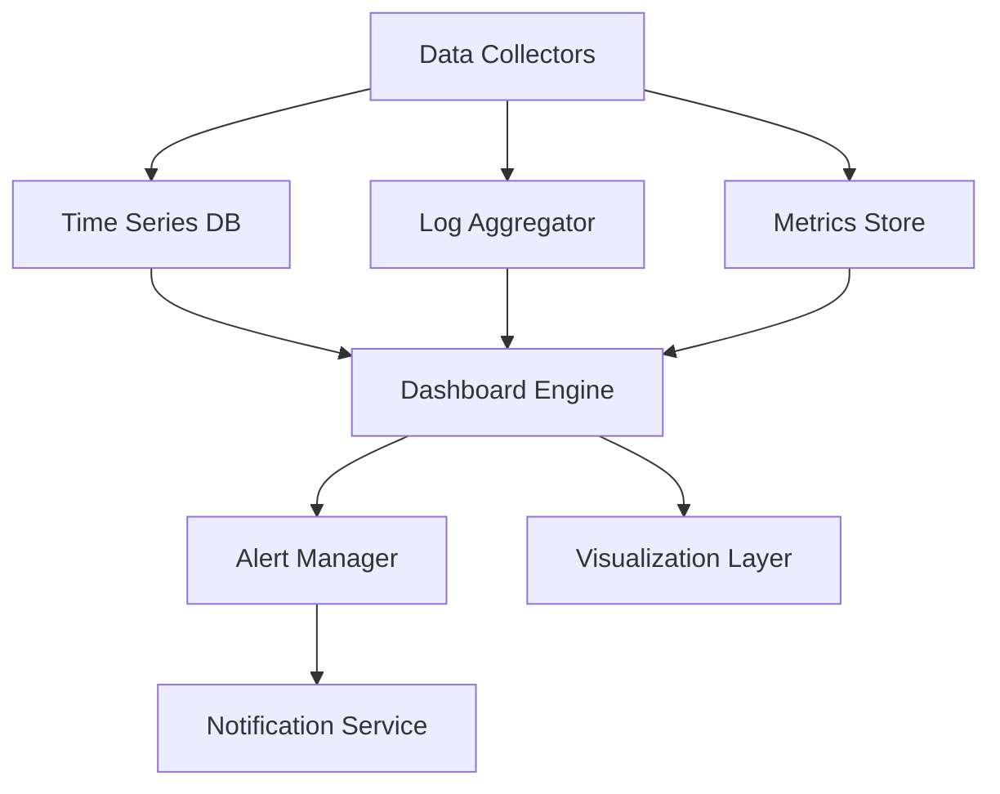

# Monitoring & Dashboard

## Overview

The Monitoring & Dashboard component provides comprehensive observability and analytics capabilities for the AI Marketplace platform. It enables real-time monitoring, alerting, and visualization of system performance, resource usage, and business metrics.

## Key Features

- 📊 **Real-time Monitoring**
  - System performance metrics
  - Resource utilization tracking
  - API usage statistics
  - Cost monitoring

- 🔔 **Alerting System**
  - Custom alert rules
  - Multi-channel notifications
  - Alert aggregation
  - Incident management

- 📈 **Analytics Dashboard**
  - Customizable widgets
  - Interactive visualizations
  - Export capabilities
  - Scheduled reports

## Architecture



## Getting Started

### Prerequisites

- Python 3.8+ for SDK usage
- Basic understanding of monitoring concepts
- API key for authentication

### Quick Start

1. **Install the SDK:**
   ```bash
   pip install ai-marketplace-monitoring
   ```

2. **Initialize the client:**
   ```python
   from ai_marketplace.monitoring import MonitoringClient

   client = MonitoringClient(api_key="your-api-key")
   ```

3. **Create a dashboard:**
   ```python
   dashboard = client.create_dashboard(
       name="System Overview",
       description="Key system metrics"
   )
   ```

4. **Add widgets:**
   ```python
   dashboard.add_widget(
       type="line_chart",
       title="API Usage",
       metric="api_calls",
       time_range="24h"
   )
   ```

## Best Practices

1. **Metric Collection**
   - Define clear metrics
   - Set appropriate collection intervals
   - Implement proper aggregation
   - Monitor collection overhead

2. **Alert Configuration**
   - Set meaningful thresholds
   - Use appropriate alert channels
   - Implement alert grouping
   - Regular alert review

3. **Dashboard Design**
   - Organize by functionality
   - Use appropriate visualizations
   - Implement proper filtering
   - Regular updates

## Advanced Features

### Custom Metrics

```python
# Define custom metric
client.create_metric(
    name="custom_metric",
    type="gauge",
    description="Custom business metric",
    labels=["environment", "service"]
)

# Record metric value
client.record_metric(
    name="custom_metric",
    value=42,
    labels={"environment": "prod", "service": "api"}
)
```

### Alert Rules

```python
# Create alert rule
client.create_alert_rule(
    name="high_error_rate",
    condition="error_rate > 0.05",
    duration="5m",
    severity="critical",
    channels=["email", "slack"]
)
```

### Dashboard API

```python
# Export dashboard
dashboard.export(format="pdf")

# Schedule report
dashboard.schedule_report(
    frequency="daily",
    format="pdf",
    recipients=["team@example.com"]
)
```

## Monitoring and Analytics

- System health metrics
- Performance indicators
- Cost analysis
- Usage patterns

## Support and Resources

- [API Documentation](api-reference/endpoints.md)
- [SDK Documentation](api-reference/sdk.md)
- [Community Forum](https://community.ai-marketplace.com)
- [Support Email](mailto:support@ai-marketplace.com)

## Related Components

- [LLM Integration](components/llm/overview.md) - For model performance monitoring
- [Vector Database](components/vector-db/overview.md) - For query performance tracking
- [Agentic System](components/agentic/overview.md) - For agent behavior monitoring 