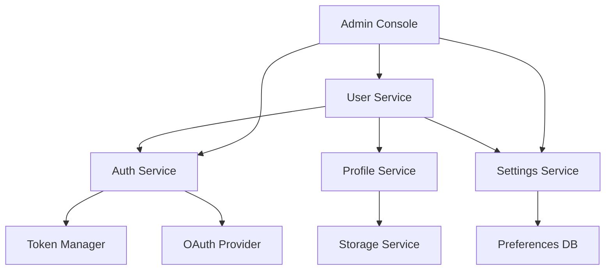

# User Settings & Management

## Overview

The User Settings & Management component provides a comprehensive system for managing user accounts, permissions, and preferences within the AI Marketplace platform. It ensures secure access control, personalized experiences, and efficient user administration.

## Key Features

- 👤 **User Management**
  - Account creation and deletion
  - Profile management
  - Role-based access control
  - Multi-factor authentication

- 🔐 **Security & Authentication**
  - OAuth 2.0 integration
  - JWT token management
  - Password policies
  - Session management

- ⚙️ **Preferences & Settings**
  - UI customization
  - Notification preferences
  - API key management
  - Billing settings

## Architecture



## Getting Started

### Prerequisites

- Python 3.8+ for SDK usage
- API key for authentication
- Basic understanding of OAuth 2.0

### Quick Start

1. **Install the SDK:**
   ```bash
   pip install ai-marketplace-users
   ```

2. **Initialize the client:**
   ```python
   from ai_marketplace.users import UserClient

   client = UserClient(api_key="your-api-key")
   ```

3. **Create a new user:**
   ```python
   user = client.create_user(
       email="user@example.com",
       password="secure_password",
       role="developer"
   )
   ```

4. **Update user settings:**
   ```python
   user.update_settings(
       theme="dark",
       notifications={"email": True, "slack": False},
       language="en"
   )
   ```

## Best Practices

1. **User Management**
   - Implement strong password policies
   - Regular security audits
   - Proper role assignment
   - Account lifecycle management

2. **Security**
   - Use secure authentication methods
   - Implement rate limiting
   - Regular token rotation
   - Audit logging

3. **Settings Management**
   - Default values for new users
   - Settings validation
   - Change history tracking
   - Bulk updates support

## Advanced Features

### Role Management

```python
# Create custom role
client.create_role(
    name="custom_role",
    permissions=[
        "read:models",
        "write:models",
        "delete:models"
    ]
)

# Assign role to user
user.assign_role("custom_role")
```

### API Key Management

```python
# Generate API key
api_key = user.generate_api_key(
    name="production",
    expires_in="30d",
    scopes=["read", "write"]
)

# List API keys
keys = user.list_api_keys()
```

### User Preferences

```python
# Set user preferences
user.set_preferences({
    "theme": "dark",
    "notifications": {
        "email": True,
        "slack": False
    },
    "language": "en"
})

# Get user preferences
preferences = user.get_preferences()
```

## Security Considerations

- Password hashing and salting
- Token encryption
- Rate limiting
- IP whitelisting
- Session management
- Audit logging

## Support and Resources

- [API Documentation](api-reference/endpoints.md)
- [SDK Documentation](api-reference/sdk.md)
- [Security Guide](security-guide.md)
- [Community Forum](https://community.ai-marketplace.com)
- [Support Email](mailto:support@ai-marketplace.com)

## Related Components

- [LLM Integration](components/llm/overview.md) - For model access control
- [Vector Database](components/vector-db/overview.md) - For data access management
- [Agentic System](components/agentic/overview.md) - For agent permissions
- [Monitoring & Dashboard](components/monitoring/overview.md) - For user activity tracking 