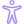

  <!-- Enhanced background elements -->
  

  

  

  

  

  
  <!-- Enhanced title with animated highlight -->
  <h1 class="main-title">
    Welcome to
    Syntera Marketplace
  </h1>
  
  <!-- Enhanced subtitle with better typing animation -->
  

    
    |
    <noscript>Enterprise-Grade Platform for AI, LLMs, Vector Databases, and Agentic Systems</noscript>
  

  
  <!-- Enhanced actions with icon integration -->
  

    <a href="getting-started/introduction" class="main-btn primary">
      ➔
      Get Started
    </a>
    <a href="#features" class="main-btn secondary">
      ↓
      Explore Features
    </a>
    <a href="https://mart-dev.syntera.ai" class="main-btn accent" target="_blank">
      ⚡
      Launch Console
    </a>
  

  
  <!-- Trust indicators or quick stats -->
  

    

      500+
      Models
    

    

      50M+
      API Requests
    

    

      99.9%
      Uptime
    

  

---

  <h2 class="section-title">Platform Highlights</h2>
  

    

      

        
      

      <h3>LLM Integration</h3>
      
Deploy, manage, and access open-source and proprietary large language models with robust API endpoints, resource scaling, and on-premises options.

      <a href="components/llm/overview/" class="feature-link">Learn More →</a>
    

    

      

        
      

      <h3>Vector Database</h3>
      
Store and search high-dimensional vector embeddings for semantic search, recommendations, and AI-powered applications. Supports Chroma, Milvus, Qdrant, and more.

      <a href="components/vector-db/overview/" class="feature-link">Learn More →</a>
    

    

      

        
      

      <h3>Agentic System</h3>
      
Build, orchestrate, and monitor AI agents for automation, workflow management, and intelligent decision-making across your enterprise.

      <a href="components/agentic/overview/" class="feature-link">Learn More →</a>
    

    

      

        
      

      <h3>Monitoring & Dashboard</h3>
      
Real-time monitoring, alerting, and analytics dashboards for all AI workloads, with resource usage, cost tracking, and performance insights.

      <a href="components/monitoring/overview/" class="feature-link">Learn More →</a>
    

    

      

        
      

      <h3>User Management</h3>
      
Comprehensive user, role, and API key management with enterprise-grade security, RBAC, and audit logging.

      <a href="components/user-management/overview/" class="feature-link">Learn More →</a>
    

  

---

<footer class="main-footer">
  

    <!-- Logo and Mission Statement -->
    

      

        Syntera
        AI
      

      
AI for the Enterprise Era

    

    
    <!-- Navigation Links -->
    

      

        <h4 class="footer-heading">Platform</h4>
        <ul class="footer-links-list">
          <li><a href="/getting-started/introduction/">Documentation</a></li>
          <li><a href="/components/llm/overview/">LLM Integration</a></li>
          <li><a href="/components/vector-db/overview/">Vector Database</a></li>
          <li><a href="/components/agentic/overview/">Agentic Systems</a></li>
        </ul>
      

      
      

        <h4 class="footer-heading">Resources</h4>
        <ul class="footer-links-list">
          <li><a href="/resources/guides/">Guides</a></li>
          <li><a href="/resources/case-studies/">Case Studies</a></li>
          <li><a href="https://github.com/your-org/ai-marketplace-docs" target="_blank">GitHub ↗</a></li>
          <li><a href="/resources/faq/">FAQ</a></li>
        </ul>
      

      
      

        <h4 class="footer-heading">Connect</h4>
        <ul class="footer-links-list">
          <li><a href="https://marketplace.syntera.ai" target="_blank">Platform Console ↗</a></li>
          <li><a href="mailto:support@ai-marketplace.com">Contact Support</a></li>
          <li><a href="/legal/privacy-policy/">Privacy Policy</a></li>
          <li><a href="/legal/terms-of-service/">Terms of Service</a></li>
        </ul>
      

    

  

  
  <!-- Copyright and Social Links -->
  

    
© 2025 Syntera Marketplace. All rights reserved.

    
    

      <a href="https://twitter.com/syntera" target="_blank" class="social-link" aria-label="Twitter">
        <svg viewBox="0 0 24 24" width="18" height="18" stroke="currentColor" stroke-width="2" fill="none" stroke-linecap="round" stroke-linejoin="round"><path d="M23 3a10.9 10.9 0 0 1-3.14 1.53 4.48 4.48 0 0 0-7.86 3v1A10.66 10.66 0 0 1 3 4s-4 9 5 13a11.64 11.64 0 0 1-7 2c9 5 20 0 20-11.5a4.5 4.5 0 0 0-.08-.83A7.72 7.72 0 0 0 23 3z"></path></svg>
      </a>
      <a href="https://github.com/your-org" target="_blank" class="social-link" aria-label="GitHub">
        <svg viewBox="0 0 24 24" width="18" height="18" stroke="currentColor" stroke-width="2" fill="none" stroke-linecap="round" stroke-linejoin="round"><path d="M9 19c-5 1.5-5-2.5-7-3m14 6v-3.87a3.37 3.37 0 0 0-.94-2.61c3.14-.35 6.44-1.54 6.44-7A5.44 5.44 0 0 0 20 4.77 5.07 5.07 0 0 0 19.91 1S18.73.65 16 2.48a13.38 13.38 0 0 0-7 0C6.27.65 5.09 1 5.09 1A5.07 5.07 0 0 0 5 4.77a5.44 5.44 0 0 0-1.5 3.78c0 5.42 3.3 6.61 6.44 7A3.37 3.37 0 0 0 9 18.13V22"></path></svg>
      </a>
      <a href="https://linkedin.com/company/syntera" target="_blank" class="social-link" aria-label="LinkedIn">
        <svg viewBox="0 0 24 24" width="18" height="18" stroke="currentColor" stroke-width="2" fill="none" stroke-linecap="round" stroke-linejoin="round"><path d="M16 8a6 6 0 0 1 6 6v7h-4v-7a2 2 0 0 0-2-2 2 2 0 0 0-2 2v7h-4v-7a6 6 0 0 1 6-6z"></path><rect x="2" y="9" width="4" height="12"></rect><circle cx="4" cy="4" r="2"></circle></svg>
      </a>
      <a href="https://discord.gg/syntera" target="_blank" class="social-link" aria-label="Discord">
        <svg viewBox="0 0 24 24" width="18" height="18" stroke="currentColor" stroke-width="2" fill="none" stroke-linecap="round" stroke-linejoin="round"><path d="M21 10c0 0-2.5-5-9-5s-9 5-9 5c0 0 2.5 5 9 5s9-5 9-5z"></path><circle cx="12" cy="10" r="3"></circle></svg>
      </a>
    

  

</footer>

<!-- Custom CSS for enhanced styling -->

 