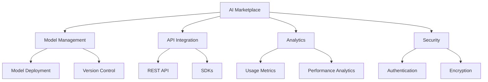

# Welcome to AI Marketplace Documentation

Welcome to the comprehensive documentation for the AI Marketplace platform. This documentation will guide you through everything you need to know about our AI marketplace, from getting started to advanced features and best practices.

## What is AI Marketplace?

AI Marketplace is a cutting-edge platform that connects AI model providers with users, enabling seamless integration and deployment of artificial intelligence solutions. Our platform offers:

- 🤖 Access to state-of-the-art AI models
- 🔄 Easy integration with existing systems
- 📊 Comprehensive analytics and monitoring
- 🔒 Enterprise-grade security
- 🌐 Scalable infrastructure

## Quick Links

- [Getting Started](getting-started/introduction.md) - Begin your journey with AI Marketplace
- [User Guide](user-guide/overview.md) - Learn about platform features and capabilities
- [API Reference](api-reference/authentication.md) - Detailed API documentation
- [Tutorials](tutorials/basic-usage.md) - Step-by-step guides and examples

## Key Features

## Getting Started

To get started with AI Marketplace, follow these simple steps:

1. [Create an account](getting-started/quick-start.md#creating-an-account)
2. [Set up your environment](getting-started/installation.md)
3. [Deploy your first model](tutorials/basic-usage.md)

## Support

Need help? We're here for you:

- 📚 [Documentation](user-guide/overview.md)
- 💬 [Community Forum](https://community.ai-marketplace.com)
- 🎓 [Tutorials](tutorials/basic-usage.md)
- 📧 [Contact Support](mailto:support@ai-marketplace.com)

## Latest Updates

!!! note "What's New"
    Check out our [latest features](user-guide/features.md) and [release notes](changelog.md) to stay up to date with the platform's capabilities.

## Contributing

We welcome contributions to our documentation! Please see our [Contributing Guide](contributing.md) for more information. 